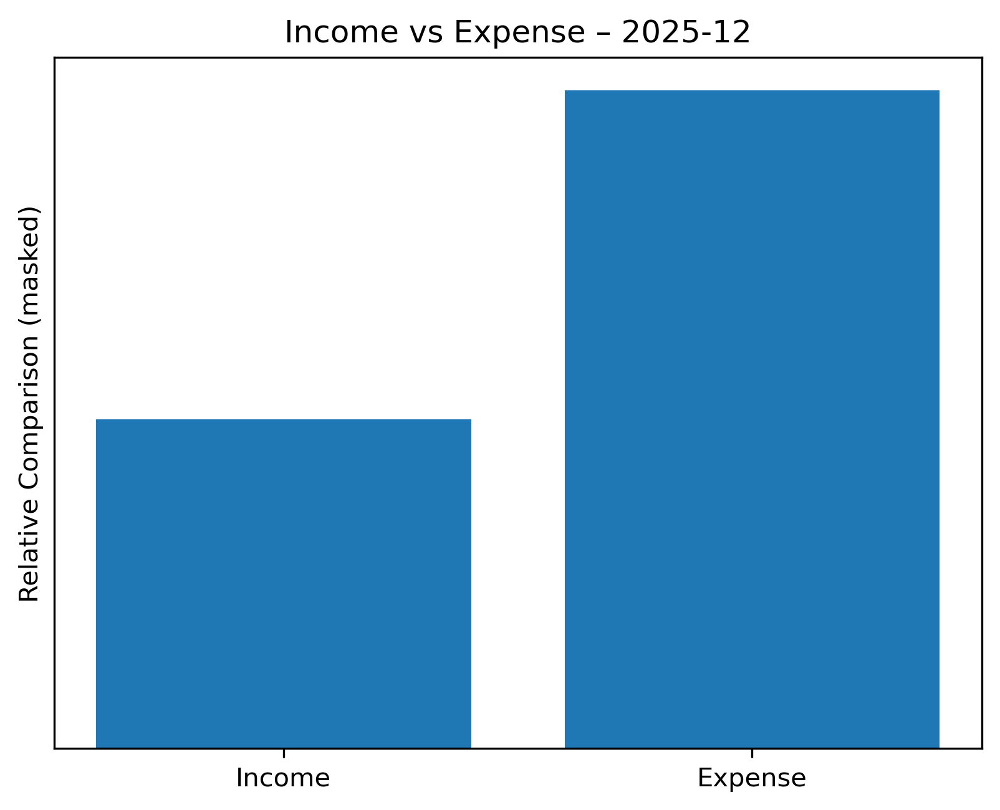
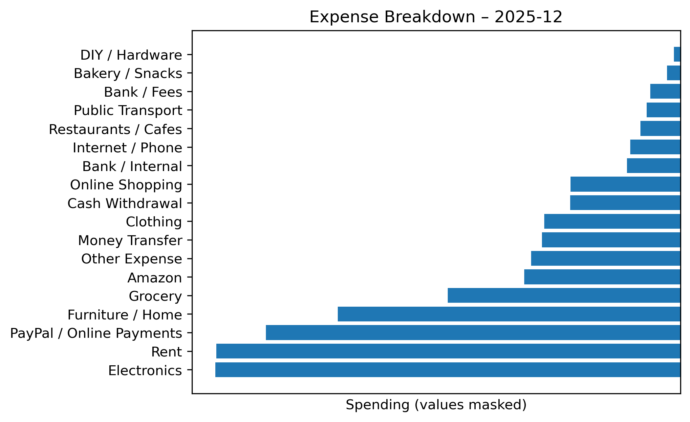

# Automated Personal Finance Analysis (Python)

## Overview
This project is a personal data analytics and automation experiment built with Python.

The idea started from a simple problem:  
banking apps show transactions, but not always clear insights.

This project turns raw bank transaction data into structured, readable insights by automating the full analysis flow.

With a single execution, the notebook:
- Cleans and prepares transaction data
- Categorizes expenses and income
- Aggregates data on a monthly level
- Generates visual summaries
- Exports ready-to-use reports automatically

All data shown in this repository is anonymized and used for demonstration purposes only.

---

## Why This Project
- Practice real-world data cleaning and transformation
- Apply analytics to a personal, non-synthetic dataset
- Build an end-to-end automated workflow
- Improve reproducibility and reporting using Python

The goal is not to build another finance app, but to learn how to design **automated data pipelines that turn raw data into insights**.

---

## Tech Stack
- Python
- pandas
- matplotlib
- Jupyter Notebook

---

## Key Features
- Rule-based expense and income categorization
- Monthly aggregation of transactions
- Income vs Outcome analysis
- Category-level spending analysis
- Automated generation of visual reports (PNG)
- One-click execution workflow
- Clean, reusable notebook structure

---

## Project Structure
```text
automated-personal-finance-analysis/
├── notebooks/
│   └── finance_analysis.ipynb  # Main analysis and automation notebook
├── README.md
├── requirements.txt
└── screenshots/ # Generated visual outputs
```

---

## Example Outputs

### Income vs Expense (Monthly)
High-level comparison between income and expenses for a given month.



### Spending by Category
Breakdown of expenses by category to highlight where money is actually going.



All monetary values are intentionally masked to focus on structure and insights rather than amounts.

---

## How It Works (High Level)
1. Load raw transaction data
2. Standardize and clean the dataset
3. Apply categorization rules based on transaction descriptions
4. Aggregate data by month and category
5. Generate visual summaries
6. Export results as images for reporting or sharing

---

## Next Steps / Roadmap
Planned improvements for future iterations:
- Automated monthly execution
- Email delivery of monthly reports
- Exporting summaries as PDF or PPT
- Dashboard-style visual layout
- Improved categorization logic
- Optional integration with banking data sources (where legally and technically feasible)

---

## Notes
- Real bank data is not included
- All examples are anonymized
- Financial values are intentionally hidden
- This project is for learning and demonstration purposes
